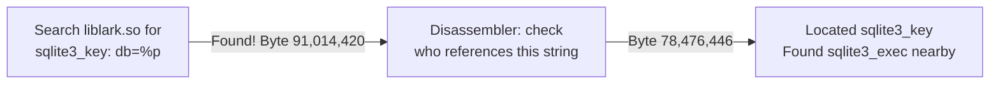
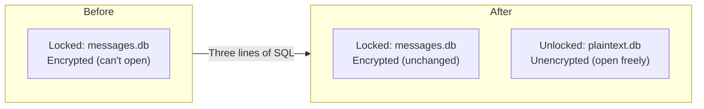
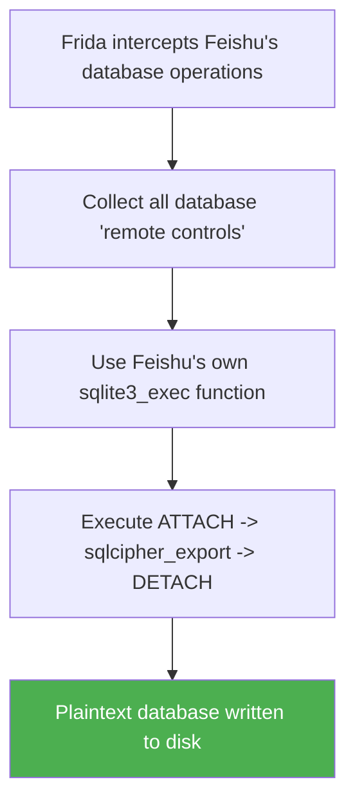
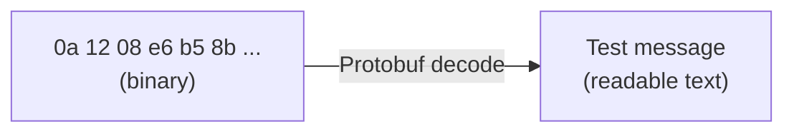
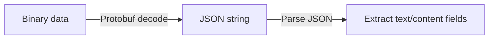
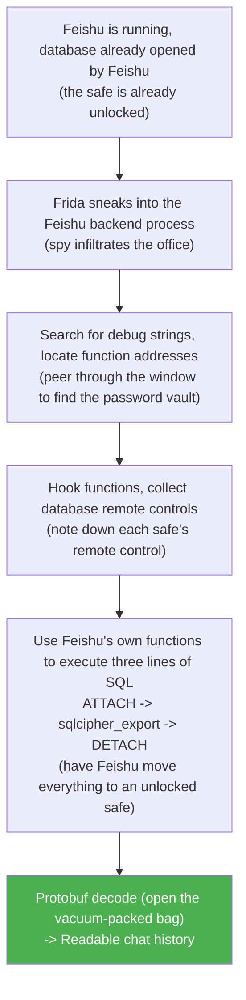

# Decrypting Feishu Chat History: A Complete Reverse Engineering Adventure

> **TL;DR: No cracking passwords, no picking locks. We made Feishu unlock the door itself and carry the data out for us.**

---

## What's the Problem?

Picture this scenario:

You want to export your own Feishu (Lark) chat history -- maybe for backup, maybe for data analysis. You find the data files Feishu stores on your computer:

```
Linux:  ~/.config/LarkShell/sdk_storage/xxxx/messages.db
macOS:  ~/Library/Containers/com.bytedance.macos.feishu/.../messages.db
```

You try opening it with a database tool, and all you see is garbled nonsense.

**The file is encrypted.**

That's the problem we need to solve: **how do we get our own chat history out?**

In this post, I'll walk you through the entire cracking process from start to finish -- including two failures and the eventual success. By the end, you'll not only know how to do it, but understand the thinking behind the whole reverse engineering approach.

---

## Part One: Background Knowledge

Before we start cracking, let's get familiar with 5 concepts. They'll come up repeatedly later, and spending two minutes understanding them now will save you a lot of confusion down the road.

### 1. SQLite -- A Single File Is a Whole Database

**In one sentence:** The most widely used database in the world -- one file can hold multiple tables.

**Everyday analogy:** Think of it like an Excel file -- open it and you see rows and columns, except programs read and write to it instead of humans.

**How Feishu uses it:** Feishu stores your chat history in a SQLite file called `messages.db`, where each message is a row in the table:

| Sender   | Time  | Content      |
|----------|-------|--------------|
| Alice    | 10:01 | Hello        |
| Bob      | 10:02 | You there?   |
| Alice    | 10:03 | See you tomorrow |

### 2. SQLCipher -- A Lock on the Database

**In one sentence:** SQLite + AES-256 encryption -- you need a password to open it.

**Everyday analogy:** If SQLite is a transparent safe (anyone can see what's inside), SQLCipher is **a combination lock bolted onto that safe**.

**How Feishu uses it:** Feishu uses SQLCipher to encrypt `messages.db`. Without the password, all you see is gibberish. And Feishu went a step further -- they **tampered with the lock's parameters**. The standard keyhole is 36mm in diameter; Feishu changed it to 99mm. That means even if you have the password, a normal key (standard SQLCipher tools) won't fit.

### 3. Strip -- Ripping Off All the Room Signs

**In one sentence:** Removing all function names from a program so nobody can read the code structure.

**Everyday analogy:** Imagine an office building where every room has a sign on the door -- "101 - Finance," "102 - HR," "103 - Password Vault." Strip tears off every single sign. People are still working inside, but standing in the hallway, you have no idea which room is which.

| Before Strip (signs up)     | After Strip (signs gone)    |
|:---:|:---:|
| 101 - Finance               | ??? - Someone's working     |
| 102 - HR                    | ??? - Someone's working     |
| **103 - Password Vault <-- go here** | **??? - Someone's working <-- which one?** |
| 104 - Engineering           | ??? - Someone's working     |

**How Feishu uses it:** Feishu runs strip before release. The 116MB core file `liblark.so` has tens of thousands of functions, all turned into anonymous code blocks. The key functions we're looking for -- `sqlite3_key`, `sqlite3_exec` -- have had their names completely erased.

### 4. Frida -- A Spy That Can Sneak Inside a Running Program

**In one sentence:** A dynamic instrumentation tool that can sneak into a running program to eavesdrop, observe, and even make it do things.

**Everyday analogy:** Feishu is a restaurant that's open for business, and you can't get into the kitchen. Frida is like planting an undercover agent in the kitchen:

| Capability   | Safe analogy                      | What it actually does        |
|--------------|-----------------------------------|------------------------------|
| **Spy**      | See what the safe's combination is | Monitor function arguments   |
| **Eavesdrop**| Hear when the safe gets opened    | Intercept function calls     |
| **Command**  | Tell the manager to open the safe again | Call internal functions  |

**How Feishu uses it:** Frida was the key tool behind our eventual success. It doesn't need source code, doesn't need recompilation, and doesn't need to pause Feishu -- it operates directly on the running process.

### 5. Protobuf -- Vacuum-Packed Data

**In one sentence:** A data serialization format invented by Google that compresses structured data into compact binary.

**Everyday analogy:** When you ship a package, you compress and pack everything tightly. Protobuf is like a "vacuum storage bag" for data -- small footprint, fast to transmit, but you can't tell what's inside until you open it.

**How Feishu uses it:** Feishu doesn't store chat messages as plain text. Instead, it packs them with Protobuf first, then stores them in the database. So even after the database is decrypted, the message content still needs to be "unpacked" one more time.

---

## Part Two: The Cracking Process

This is the heart of the article. I'll present the entire process in **real chronological order**, including the failed attempts. Reverse engineering is fundamentally about trial and error -- every failure brings new clues.

### Round One: LD_PRELOAD Interception -- Failed

#### The Idea

The password is passed to SQLCipher by Feishu at runtime. If we can intercept that handoff, we can steal the password.

Linux has a mechanism called **LD_PRELOAD**: before a program starts, it loads a fake function library that we wrote first. When Feishu calls `sqlite3_key` (the function that passes the password), it actually hits our fake version first -- we log the password, then forward the call to the real one.

**Safe analogy:** The safe manager has to register the combination every time before opening the lock. We planted someone at the registration desk to secretly copy down the combination.

#### Result: Failed

Feishu never went through our "registration desk."

#### Why

LD_PRELOAD can only intercept **dynamically linked** functions -- those that a program loads from external libraries at runtime. But Feishu **compiled SQLCipher's code directly into its own binary** (static linking), so it never needs to load anything from outside.

**Analogy:** We set up a checkpoint at the building entrance, but the safe manager lives inside the building and never walks through the front door.

#### What We Learned

Although we failed, we confirmed something important: **SQLCipher is statically compiled into `liblark.so`**. That means all encryption-related code lives inside this file -- that's where we need to look next.

---

### Round Two: Frida Steals the Password -- Got It, But It's Useless

#### The Idea

LD_PRELOAD can't catch it? Switch to Frida. Frida burrows directly into the Feishu process -- it can intercept functions regardless of whether they're dynamic or static.

**Safe analogy:** The front door checkpoint didn't work? Then send a spy straight into the office to crouch next to the safe and watch the combination being entered.

#### The Catch: Function Names Were Stripped

Frida needs to know a function's address to intercept it. Normally, we could look up the address through the function name `sqlite3_key`. But Feishu ran strip, and all function names were deleted.

What now?

#### The Solution: Searching for Debug Strings

The room signs are gone, but **the stuff inside the rooms wasn't deleted**.

Feishu's developers left a debug log line inside the encryption function: `"sqlite3_key: db=%p"`. Function names can be erased, but this string is still sitting in the binary:



**Analogy:** The room signs were torn off, but through the window you can see the words "Password Vault" written on a desk inside.

#### Result: Successfully Stole the Password

Frida intercepted the password that Feishu passed to the encryption function:

```
Feishu: Open messages.db with password "x'307435c4...'"
Frida:  Overheard it! Password is "x'307435c4...'"
```

#### But: The Password Was Useless

With the password in hand, we tried decrypting with standard SQLCipher tools -- **every attempt failed**.

The reason is that Feishu **tampered with the encryption parameters**:

```
Standard SQLCipher:     reserve_sz = 36
Feishu's SQLCipher:     reserve_sz = 99  <-- different
```

**Analogy:** We got the combination, but the lock on the safe is custom-made. Our key has the right shape but the wrong dimensions -- it won't fit. Only the key that Feishu manufactured itself will work.

#### What We Learned

Although the password turned out to be useless on its own, this round gave us two crucial capabilities:
1. We can locate target functions in a stripped binary
2. Frida can indeed burrow into the Feishu process and intercept function calls

---

### Round Three: Make Feishu Export It Itself -- Success

#### The Shift in Thinking

The first two failures gave us an insight:

- Round One: Couldn't intercept (static linking)
- Round Two: Intercepted, but the password was useless (parameters were tampered with)

The root of the problem was that **we were trying to pick the lock ourselves, but the lock is custom-made**.

New approach: **Don't pick the lock. Get Feishu to open it for us.**

Feishu is already running, and the database has already been opened by Feishu itself -- it has the key, and the key is already in the lock. All we need is for Feishu to **do one more thing**: copy everything from the locked safe into a **brand new, unlocked safe**.

#### The Principle: Three Lines of SQL

These three lines of SQL are the core of the entire decryption.

**Line one: Place an empty safe**

```sql
ATTACH DATABASE '/tmp/plaintext.db' AS pt KEY '';
```

Place an unlocked, empty safe next to the encrypted safe that Feishu already has open.
- `ATTACH DATABASE` = open a new database file
- `AS pt` = give it the alias pt (plaintext)
- `KEY ''` = empty password, **no encryption**

**Line two: Move everything over**

```sql
SELECT sqlcipher_export('pt');
```

Have Feishu copy **everything** from the encrypted safe into the unlocked empty safe next to it, exactly as-is. This step is executed by Feishu's own code -- it has the key, it can read the encrypted data, and then it writes it into the new, unencrypted database.

**Line three: Done, disconnect**

```sql
DETACH DATABASE pt;
```

The move is complete; disconnect from the new safe.

**After execution:**



#### Implementation

Now that we know the principle, the next question is: **how do we get Feishu to execute these three lines of SQL?**

The answer, once again, is Frida. Two steps:

**Step one: Collect database "remote controls"**

Every time Feishu opens a database, the system gives it a "handle" -- think of it as a **remote control**: you need to hold this remote to issue commands to that database. Frida intercepts Feishu's `sqlite3_exec` and `sqlite3_prepare_v2` functions, and every time Feishu operates on a database, it secretly records which remote control is being used.

**Step two: Use the remote controls to run the export**

Once we've collected the remote controls, Frida uses Feishu's own `sqlite3_exec` function, holding the remote control, and executes those three lines of SQL. Feishu thinks it's operating on its own and obediently complies.



#### Pitfalls Along the Way

The implementation wasn't entirely smooth sailing. Here are a few notable pitfalls:

- **Recursive hook**: Frida intercepts `sqlite3_exec`, then uses `sqlite3_exec` to run the export -- this triggers the interceptor intercepting itself, causing infinite recursion. The fix: add a flag to skip interception during the export.
- **sudo path issues**: Frida needs root privileges to inject into a process, but sudo wipes environment variables, causing Frida to become unfindable.
- **Lost DISPLAY variable**: Automating clicks on the Feishu UI requires the DISPLAY environment variable, which also gets wiped by sudo.

#### Result: Success

In the end, we successfully exported 15 databases containing a total of 448 messages.

---

### The Final Step: Unwrapping the Protobuf Packaging

The database is decrypted. Open it with a tool and you can see the tables -- but the message content column is still a bunch of binary gibberish.

**This isn't encryption; it's packaging.** Feishu "vacuum-packed" the message content with Protobuf. We need to unwrap it one more time:



For card messages (like tech newsletters), the structure is a bit more complex -- Protobuf wraps JSON inside it:



The export tool handles this decoding process automatically.

---

## Part Three: Extended Knowledge and Methodology

### What If Feishu Strengthens Its Protections?

We were able to find the functions because Feishu's developers left the debug string `"sqlite3_key: db=%p"` in the binary. What if a future version of Feishu removes the debug strings too?

Don't worry -- there are plenty of other approaches:

**Method 1: Search for functional strings**

Debug strings are optional; removing them doesn't break the program. But some strings are **essential for the program to run** -- like SQL statements such as `"PRAGMA key"` and `"SELECT sqlcipher_export"`. Remove those, and the program crashes on its own.

**Method 2: Signature matching**

SQLCipher is open source. We can compile our own copy, see what the functions look like when compiled to machine code, and then search for similar instruction patterns in Feishu's binary.

Analogy: The room signs are gone, the notes on the desk are gone too, but **the room's layout** matches the publicly available architectural blueprints.

**Method 3: Behavioral tracing**

Don't look for function names at all -- just observe behavior. Use `strace` / `ltrace` to monitor which files Feishu opens and which system calls it makes, then follow the trail to the encryption-related code.

Analogy: Watch the hallway to see who goes in and out of the vault room, then follow them.

**Method 4: Import function analysis**

Feishu deleted its own function names, but the names of **system functions** it calls are still there (`malloc`, `mmap`, `open`, etc.). By analyzing which code calls cryptography-related system functions, we can work backwards to identify the target functions.

**Method 5: IDA Pro signature matching**

The professional reverse engineering tool IDA Pro can automatically recognize function signatures from known open-source libraries, even after they've been stripped.

**Method 6: Binary diffing**

Compare binary files across different versions of Feishu and observe which functions remain unchanged between versions -- these are likely stable third-party library functions (like SQLCipher).

### Comparison of Function Location Methods

| Method | Difficulty | Prerequisites | Notes |
|--------|-----------|---------------|-------|
| Search debug strings | * | Debug strings not removed | The method we used; simplest |
| Search functional strings | ** | None | Runtime-essential strings can't be removed |
| Signature matching | *** | Open source code available for comparison | Compare compiled output |
| Behavioral tracing | *** | Ability to run the program | Monitor runtime behavior |
| Import function analysis | **** | Reverse engineering experience | Work backwards from system calls |
| IDA Pro signature matching | **** | Professional tools required | Auto-identifies known libraries |
| Binary diffing | *** | Multiple versions available | Diff to find stable functions |

### Reverse Engineering Tool Comparison

| Tool | Approach | Characteristics | Use Case |
|------|----------|----------------|----------|
| **GDB** | Breakpoint debugging | Pauses the program for step-by-step execution | Precisely analyzing a specific function's behavior |
| **Frida** | Dynamic instrumentation | **Doesn't pause the program**, real-time monitoring | Intercepting functions, modifying behavior (our approach) |
| **IDA Pro** | Static decompilation | Analyzes code without running the program | Analyzing program logic and structure |
| **LD_PRELOAD** | Replace dynamic library functions | Simple but very limited | Can only intercept dynamically linked functions |
| **objdump** | Disassembly | Translates machine code to assembly | Quick inspection of function instructions |

### Comparing the Approaches We Tried

| Approach | Result | Why It Failed/Succeeded |
|----------|--------|------------------------|
| Search config files for password | Failed | Password only exists in memory, not in any file |
| LD_PRELOAD to intercept encryption function | Failed | SQLCipher is statically compiled; can't intercept |
| Frida steals password + standard tools to decrypt | Failed | Feishu tampered with reserve_sz=99; standard tools incompatible |
| **Frida + make Feishu export it itself** | **Succeeded** | **Bypasses all compatibility issues by using Feishu's own code** |

There's a saying in the security world: **There's no software that can't be cracked, only software that isn't worth the time to crack.**

---

## Appendix

### Complete Flowchart



### One-Click Export Usage

```bash
# 1. Install dependencies
pip3 install frida frida-tools protobuf

# 2. Launch the Feishu desktop client and log in

# 3. Run the export tool (requires root privileges)
sudo python3 feishu_export.py

# 4. Exported results are in the export_output/ directory
```

### Limitations

- Feishu only caches roughly the **most recent ~30 messages per conversation** locally. You'll need to manually scroll up in the Feishu UI to load more history before re-exporting.
- macOS requires **disabling SIP** (System Integrity Protection) first; Linux has no such restriction.
- Function addresses may shift after Feishu updates, but the tool automatically re-detects them.
- `xdotool` simulated clicks don't always work on Feishu's Electron UI; some databases may need to be triggered manually.
