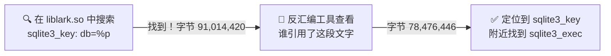
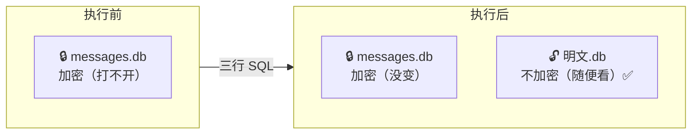
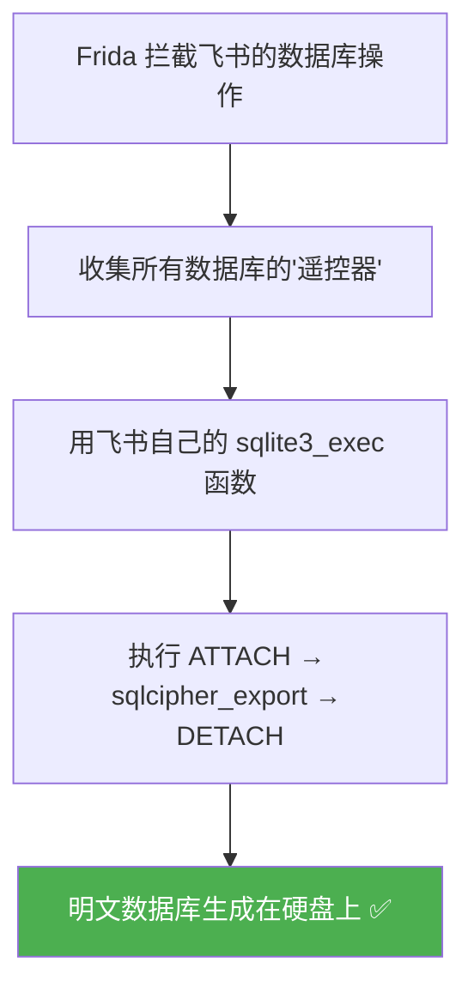
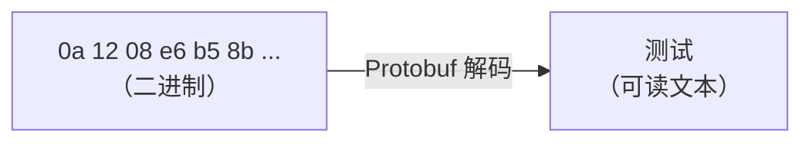
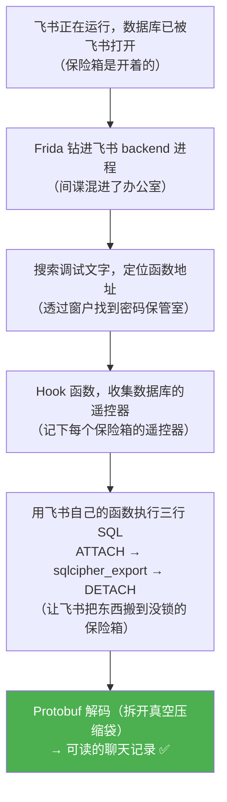

> **一句话总结：不破解密码，不撬锁。让飞书自己开锁，自己把数据搬出来。**

---

## 问题是什么？

想象一下这个场景：

你想导出自己的飞书聊天记录——也许是为了备份，也许是为了做数据分析。你找到了飞书存在电脑上的数据文件：

```
Linux:  ~/.config/LarkShell/sdk_storage/xxxx/messages.db
macOS:  ~/Library/Containers/com.bytedance.macos.feishu/.../messages.db
```

你试着用数据库工具打开它，屏幕上只有一片乱码。

**文件是加密的。**

这就是我们要解决的问题：**怎么拿到属于自己的聊天记录？**

接下来，我会完整还原这次破解的过程——包括两次失败和最终的成功。读完之后，你不仅知道怎么做，更能理解整个逆向工程的思路。

---

## 第一部分：背景知识

在开始破解之前，先认识 5 个概念。它们会在后面反复出现，现在花两分钟搞懂，后面就不会一头雾水。

### 1. SQLite —— 一个文件就是一个数据库

**一句话定义：** 世界上用得最多的数据库，一个文件就能存一张张表格。

**生活类比：** 把它想象成一个 Excel 文件——打开就能看到行和列，只不过用程序来读写。

**和飞书的关系：** 飞书把你的聊天记录存在一个叫 `messages.db` 的 SQLite 文件里，每条消息就是表格里的一行：

| 发送人 | 时间  | 内容   |
|--------|-------|--------|
| 张三   | 10:01 | 你好   |
| 李四   | 10:02 | 在吗   |
| 张三   | 10:03 | 明天见 |

### 2. SQLCipher —— 给数据库加了一把锁

**一句话定义：** SQLite + AES-256 加密，必须有密码才能打开。

**生活类比：** 如果 SQLite 是一个透明的保险箱（谁都能看见里面的东西），SQLCipher 就是给这个保险箱**装了一把密码锁**。

**和飞书的关系：** 飞书用 SQLCipher 加密了 `messages.db`。没有密码，打开只能看到乱码。而且飞书还**魔改了锁的参数**——标准锁孔的直径是 36mm，飞书改成了 99mm。这意味着就算你拿到了密码，用普通钥匙（标准 SQLCipher 工具）也插不进去。

### 3. Strip —— 把门牌号全撕了

**一句话定义：** 把程序里所有函数的名字删掉，让人看不懂代码结构。

**生活类比：** 一栋办公楼，每间办公室门口都有门牌——"101-财务部""102-人事部""103-密码保管室"。Strip 就是把所有门牌号全撕了。楼里还是有人在工作，但你站在走廊里，不知道哪间是哪间。

| Strip 前（有门牌号） | Strip 后（门牌号撕了） |
|:---:|:---:|
| 101 - 财务部 | ??? - 有人在工作 |
| 102 - 人事部 | ??? - 有人在工作 |
| **103 - 密码保管室 ← 直接找** | **??? - 有人在工作 ← 哪间？** |
| 104 - 技术部 | ??? - 有人在工作 |

**和飞书的关系：** 飞书发布前执行了 strip，116MB 的核心文件 `liblark.so` 里几万个函数全变成匿名代码块。我们想找的 `sqlite3_key`、`sqlite3_exec` 这些关键函数，名字全被删了。

### 4. Frida —— 能钻进程序内部的间谍工具

**一句话定义：** 一个动态注入工具，能钻进正在运行的程序，偷看、偷听、甚至指挥它做事。

**生活类比：** 飞书是一家正在营业的餐厅，你进不了后厨。Frida 相当于在后厨安插了一个卧底：

| 能力 | 保险箱类比 | 实际操作 |
|------|-----------|---------|
| **偷看** | 看保险箱的密码是什么 | 监控函数参数 |
| **偷听** | 听什么时候开了保险箱 | 拦截函数调用 |
| **指挥** | 让管理员多开一次保险箱 | 调用程序内部函数 |

**和飞书的关系：** Frida 是我们最终成功的关键工具。它不需要源代码、不需要重新编译、不需要暂停飞书，直接对正在运行的飞书动手。

### 5. Protobuf —— 数据的压缩包装

**一句话定义：** Google 发明的数据序列化格式，把结构化数据压缩成紧凑的二进制。

**生活类比：** 你寄快递时，会把东西打包压缩。Protobuf 就是数据的"真空压缩袋"——体积小、传输快，但拆开之前看不出里面是什么。

**和飞书的关系：** 飞书的聊天内容不是直接存文字，而是先用 Protobuf 打包再存进数据库。所以即使数据库解密了，消息内容还需要再"拆包"一次。

---

## 第二部分：破解过程

这是整篇文章的核心。我会按**真实的时间线**展示整个过程，包括失败的尝试。逆向工程的本质就是不断试错——每次失败都会带来新的线索。

### 第一回合：LD_PRELOAD 拦截 —— 失败

#### 思路

密码是飞书在运行时传给 SQLCipher 的。如果我们能拦截这个传递过程，就能偷看密码。

Linux 有一个机制叫 **LD_PRELOAD**：在程序启动前，先加载一个我们写的假函数库。当飞书调用 `sqlite3_key`（传密码的函数）时，实际上会先调用我们的假版本——我们记录下密码，再转发给真版本。

**保险箱类比：** 保险箱管理员每次开锁前要先登记密码。我们在登记处安插了一个人，偷偷抄一份密码。

#### 结果：失败

飞书根本不走我们的"登记处"。

#### 原因

LD_PRELOAD 只能拦截**动态链接**的函数——就是那些飞书在运行时从外部库加载的函数。但飞书把 SQLCipher 的代码**直接编译进了自己的程序**（静态链接），根本不需要从外面加载。

**类比：** 我们在大楼门口设了关卡，但保险箱管理员住在楼里面，从来不走大门。

#### 收获

虽然失败了，但我们确认了一个重要信息：**SQLCipher 是静态编译进 `liblark.so` 的**。这意味着所有加密相关的代码都在这个文件里，后面要在这里面找。

---

### 第二回合：Frida 偷看密码 —— 偷到了，但没用

#### 思路

LD_PRELOAD 拦不住，那就换 Frida。Frida 直接钻进飞书进程内部，不管函数是动态的还是静态的，都能拦截。

**保险箱类比：** 大门关卡没用？那就直接派间谍混进办公室，趴在保险箱旁边偷看密码。

#### 难点：函数名被 Strip 了

Frida 拦截函数需要知道函数的地址。正常情况下，我们可以通过函数名 `sqlite3_key` 查到地址。但飞书做了 strip，函数名全删了。

怎么办？

#### 解法：搜索调试文字

门牌号撕了，但**房间里的东西没删**。

飞书程序员在加密函数里写了一行调试日志：`"sqlite3_key: db=%p"`。函数名可以删，但这句文字还留在程序里：



**类比：** 门牌号撕了，但透过窗户看到桌上写着"密码保管室"四个字。

#### 结果：成功偷看到密码

Frida 拦截到飞书调用加密函数时传入的密码：

```
飞书：用密码 "x'307435c4...'" 打开 messages.db
Frida：偷听到了！密码是 "x'307435c4...'"
```

#### 但是：密码没用

拿到密码后，我们用标准 SQLCipher 工具尝试解密——**全部失败**。

原因是飞书**魔改了加密参数**：

```
标准 SQLCipher:     reserve_sz = 36
飞书的 SQLCipher:   reserve_sz = 99  ← 不一样
```

**类比：** 密码拿到了，但保险箱的锁孔是定制的。我们的钥匙形状对了，但尺寸不对，插不进去。只有飞书自己造的那把钥匙才能用。

#### 收获

虽然密码不能直接用，但这一轮我们掌握了两个关键能力：
1. 能在 strip 后的程序里找到目标函数
2. Frida 确实能钻进飞书进程并拦截函数调用

---

### 第三回合：让飞书自己导出 —— 成功

#### 思路转变

前两次失败给了我们启发：

- 第一回合：拦不住（静态链接）
- 第二回合：拦住了但密码没用（参数被魔改）

问题的根源是**我们想自己开锁，但锁是定制的**。

换个思路：**不自己开锁，让飞书帮我们开**。

飞书正在运行，数据库已经被它自己打开了——它有钥匙，而且钥匙正插在锁上。我们只需要让飞书**多做一步**：把保险箱里的东西复制一份到一个**没上锁的新保险箱**里。

#### 原理：三行 SQL

这三行 SQL 是整个解密的核心：

**第一行：放一个空保险箱**

```sql
ATTACH DATABASE '/tmp/明文.db' AS pt KEY '';
```

在飞书已经打开的加密保险箱旁边，放一个没上锁的空保险箱。
- `ATTACH DATABASE` = 打开一个新数据库文件
- `AS pt` = 给它起个代号叫 pt（plaintext，明文）
- `KEY ''` = 密码为空，**不加密**

**第二行：搬东西**

```sql
SELECT sqlcipher_export('pt');
```

让飞书把加密保险箱里的**所有东西**，原封不动搬到旁边那个没锁的空保险箱里。这一步是飞书自己的代码在执行，它有钥匙，能读取加密数据，然后写入不加密的新数据库。

**第三行：搬完收工**

```sql
DETACH DATABASE pt;
```

搬完了，把新保险箱的连接断开。

**执行完之后：**



#### 实现过程

知道了原理，接下来的问题是：**怎么让飞书执行这三行 SQL？**

答案还是 Frida。分两步：

**第一步：收集数据库的"遥控器"**

飞书每打开一个数据库，系统就会给它一个"句柄"——你可以把它理解成**遥控器**：拿着这个遥控器，才能对这个数据库发号施令。Frida 拦截飞书的 `sqlite3_exec` 和 `sqlite3_prepare_v2` 函数，每次飞书操作数据库时，就偷偷记下它用的是哪个遥控器。

**第二步：拿着遥控器执行导出**

收集到遥控器后，Frida 用飞书自己的 `sqlite3_exec` 函数，拿着遥控器，执行那三行 SQL。飞书以为是自己在操作，乖乖执行。



#### 踩过的坑

实现过程并非一帆风顺，这里记录几个典型的坑：

- **递归 hook**：Frida 拦截了 `sqlite3_exec`，然后又用 `sqlite3_exec` 执行导出——这会触发自己拦截自己，无限递归。解决办法：加一个标志位，导出时跳过拦截。
- **sudo 路径问题**：Frida 需要 root 权限注入进程，但 sudo 后环境变量会丢失，导致找不到 Frida。
- **DISPLAY 变量丢失**：自动化点击飞书界面需要 DISPLAY 环境变量，sudo 后也会丢失。

#### 结果：成功

最终成功导出了 15 个数据库，共 448 条消息。

---

### 最后一步：拆开 Protobuf 包装

数据库解密了，用工具打开，能看到表格了——但消息内容列还是一堆二进制乱码。

**这不是加密，而是包装。** 飞书用 Protobuf 把消息内容"真空压缩"了。需要再拆一次包：



对于卡片消息（比如科技简报），结构更复杂一些——Protobuf 里面嵌套了 JSON：


导出工具会自动完成这个解码过程。

---

## 第三部分：扩展知识与方法论

### 如果飞书加强了保护怎么办？

我们能找到函数，是因为飞书程序员留了调试文字 `"sqlite3_key: db=%p"`。如果飞书在未来版本中把调试文字也删了呢？

别担心，还有很多办法：

**方法一：搜功能性字符串**

调试文字是可选的，删了程序照样运行。但有些字符串是程序**运行必需的**——比如 SQL 语句 `"PRAGMA key"`、`"SELECT sqlcipher_export"`。删了这些，程序自己就崩了。

**方法二：特征码匹配**

SQLCipher 是开源的。我们可以自己编译一份，看看函数编译成机器指令后长什么样，然后去飞书的文件里搜索相似的指令模式。

类比：门牌号撕了、桌上的纸条也没了，但**房间的格局**和公开的建筑图纸对得上。

**方法三：行为追踪**

不找函数名，直接观察行为。用 `strace` / `ltrace` 监控飞书打开了哪些文件、调用了哪些系统函数，顺藤摸瓜找到加密相关的代码。

类比：盯着走廊看谁进出了保管室，跟着他就行。

**方法四：导入函数分析**

飞书虽然删了自己的函数名，但它调用的**系统函数**名字还在（`malloc`、`mmap`、`open` 等）。通过分析谁调用了密码学相关的系统函数，可以反推目标函数。

**方法五：IDA Pro 签名匹配**

专业逆向工具 IDA Pro 能自动识别已知开源库的函数签名，即使被 strip 了也能自动标注。

**方法六：二进制对比**

对比飞书不同版本的二进制文件，观察哪些函数在版本间没有变化——这些很可能是稳定的第三方库函数（比如 SQLCipher）。

### 定位函数的方法对比

| 方法 | 难度 | 前提条件 | 说明 |
|------|------|---------|------|
| 搜调试字符串 | ⭐ | 调试文字未被删除 | 我们用的方法，最简单 |
| 搜功能性字符串 | ⭐⭐ | 无 | 运行必需的字符串不能删 |
| 特征码匹配 | ⭐⭐⭐ | 有开源代码可对比 | 对比编译结果 |
| 行为追踪 | ⭐⭐⭐ | 能运行程序 | 监控运行时行为 |
| 导入函数分析 | ⭐⭐⭐⭐ | 需要逆向经验 | 从系统调用反推 |
| IDA Pro 签名匹配 | ⭐⭐⭐⭐ | 需要专业工具 | 自动识别已知库 |
| 二进制对比 | ⭐⭐⭐ | 有多个版本 | diff 找稳定函数 |

### 逆向工具对比

| 工具 | 方式 | 特点 | 适用场景 |
|------|------|------|---------|
| **GDB** | 断点调试 | 暂停程序逐步执行 | 精确分析某个函数的行为 |
| **Frida** | 动态注入 | **不暂停程序**，实时监控 | 拦截函数、修改行为（本文方案） |
| **IDA Pro** | 静态反编译 | 不运行程序就能分析代码 | 分析程序逻辑和结构 |
| **LD_PRELOAD** | 替换动态库函数 | 简单但局限大 | 只能拦截动态链接的函数 |
| **objdump** | 反汇编 | 把机器码翻译成汇编 | 快速查看函数指令 |

### 方案对比：我们尝试过的路

| 方案 | 结果 | 失败/成功原因 |
|------|------|-------------|
| 翻配置文件找密码 | ❌ 失败 | 密码只在内存中，不存在任何文件里 |
| LD_PRELOAD 拦截加密函数 | ❌ 失败 | SQLCipher 是静态编译的，拦不住 |
| Frida 偷看密码 + 标准工具解密 | ❌ 失败 | 飞书魔改了 reserve_sz=99，标准工具不兼容 |
| **Frida + 让飞书自己导出** | ✅ **成功** | **绕过一切兼容性问题，用飞书自己的代码操作** |

安全领域有一句话：**没有破解不了的软件，只有不值得花时间破解的软件。**

---

## 附录

### 完整流程图



### 一键导出使用方法

```bash
# 1. 安装依赖
pip3 install frida frida-tools protobuf

# 2. 启动飞书桌面客户端并登录

# 3. 运行导出工具（需要 root 权限）
sudo python3 feishu_export.py

# 4. 导出结果在 export_output/ 目录
```

### 局限性

- 飞书本地只缓存每个会话**最近约 30 条消息**，需要在飞书界面手动向上滚动加载更多历史后重新导出
- macOS 需要先**关闭 SIP**（系统完整性保护），Linux 无此限制
- 飞书更新版本后函数地址可能变化，但工具会自动重新检测
- `xdotool` 模拟点击对飞书 Electron 界面不一定生效，部分数据库需要手动触发
